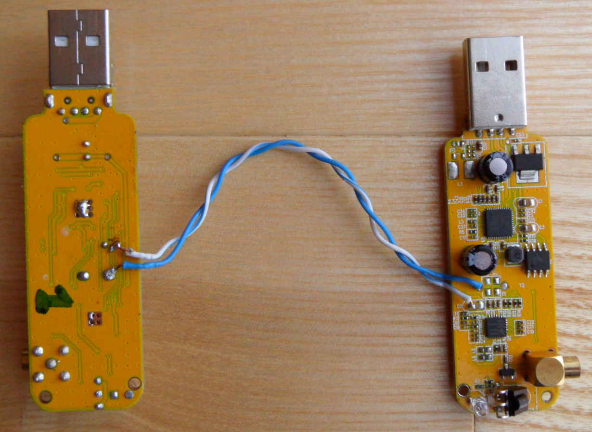

Multi-RTL
==================
`Multi-RTL` is a GNU Radio block that transforms cheap multiple `RTL-SDR` receivers into multi-channel receiver. 

`Multi-RTL` is the first software solution that enables synchronous reception with each channel based on a `RTL-SDR` receiver tuned to a different central frequency. The synchronization is done automatically and in software - without the need for any additional electronical hardware.

Mailing list
============
Current Multi-RTL project's mailing list address is following:

multi-rtl@googlegroups.com

To join the group with any e-mail addres (google account is not required) use this link:

https://groups.google.com/forum/#!forum/multi-rtl/join

Installation
==================
To install `Multi-RTL` installation of gnuradio-dev, gr-osmosdr and python-scipy is required. Tools typically used for building `GNU Radio` - cmake, swig and g++ - are also needed.

On Debian based systems to install programs required by `Multi-RTL` use following command:
```sh
sudo apt-get install gr-osmosdr gnuradio-dev cmake swig build-essential doxygen python-scipy
```

To install `Multi-RTL` first download its source code:
```sh
git clone https://github.com/ptrkrysik/multi-rtl.git
```
... then compile it and install:
```sh
cd multi-rtl
mkdir build
cd build
cmake ..
sudo make install
sudo ldconfig
```

You can also use [PyBombs](https://github.com/gnuradio/pybombs) to install `Multi-RTL`. Installation of PyBombs itself is described in [here](https://github.com/gnuradio/pybombs#installation). After installing it execute:
```sh
pybombs install multi-rtl
```
In case of installing in a directory where writing requires root privileges (like ```/usr/local```) use version of the command with sudo in front of it:
```sh
sudo pybombs install multi-rtl
```


Preparation of RTL-SDR receivers
================================
The prerequisite to use `Multi-RTL` is having two or more `RTL-SDR` devices sharing common clock source. The simplest and cheapest way to achieve that is to use the [clever hack](http://kaira.sgo.fi/2013/09/16-dual-channel-coherent-digital.html) invented by Juha Vierinen. The modification that he found is presented on the photos below:
  

The dongle on the right hand side has replaced oscillator and takes clock reference from the dongle on the left.

If you need more than three channels use solution based on external clock and clock distribution circuitry like the one descibed by [YO3IIU](http://yo3iiu.ro/blog/?p=1450).

You can also set identifiers dongles so it will be possible to distinguish channels of your `Multi-RTL` receiver. To do this set different identifier to each dongle with use of:
```sh
rtl_eeprom -d <device_index> -s <serial_number>
```
If you connect dongles one by one (so only one is connected at a time) `device_index` is 0. `serial_number` is an unique number that you assign to your dongle acting as a channel. In the rest of the README it will be assumed that consecutive numbers of the following form are used as numbers of channels: `00000001, 00000002, 00000003, ...`.

Usage
==================
Multi-RTL is a GNU Radio block. The most natural way to use it is to build a flowgraph in `gnuradio-companion` (the GNU Radio's GUI tool). 
`Multi-RTL` viewed in `gnuradio-companion` has options grouped into two cathegories:
* `General` options - that are used during normal operation of the receiver:
    * `Freq. Corr. (ppm)` - reference clock offset frequency correction in points per milion (ppm),
    * `Num Channels` - number of channels of the reciver,
    * `Chn: Frequency (Hz)` - central frequency for the `n`-th channel,
    * `Chn: RF Gain (dB)` - gain of `n`-th channel in dB,
    * `Chn: Gain Mode` - gain mode of the `n`-th channel (manual or automatic),
    * `Chn: ID string` - serial number of a RTL-SDR receiver associated with `n`-th channel,
* `Synchronization` options - that are used for the purpose of synchronization of the receivers:
    * `Sync Frequency (Hz)` - carrier frequency of the signal that is used for synchronization,
    * `Chn: Sync RF Gain (dB)` - gain of the `n`-th channel during synchronization in dB.

The `General` options are similar to [`osmocom source`](http://sdr.osmocom.org/trac/wiki/GrOsmoSDR) block. The reason is that `Multi-RTL` is hierarhical block that under the hood uses as many `osmocom source` blocks as there are channels in the receiver and passes some of the options directly to them. In comparison with `osmocom source` `Multi-RTL` doesn't include some options that don't apply to RTL-SDR receivers, like: turning on/off automatic dc offset removal, regulation of baseband gain, automatic IQ imbalance correction. 

Synchronization is performend when `Multi-RTL` is started and when user manually resynchronize the receiver's channels by calling `synchronize` function. During this process receiver's channels are configured according to `Synchronization` options. The `Sync Frequency (Hz)` should point to a carrier frequency of a signal that has good auto-correlation properties (good enough for particular application), with high and narrow peak in the central part. These properties have direct impact on accuracy of the synchronization. Examples of signals that can be used for synchronization are:
* GSM signal (i.e. GSM900 - 925-960 MHz)
* CDMA signals (UMTS900, WCDMA),
* DVB-T television (DVB-T channels can be found in 174-230 MHz and 470-862MHz frequency bands)
* DAB radio (174–230 MHz),
* FM radio (87.5 to 108.0MHz) `caution:` auto-correlation function of FM radio varry a lot in time as it is dependend on the signal that is transmitted - noisy music results with signal that has much better auto-correlation than speech or silence.

In `Multi-RTL`'s repository there is an example of `gnuradio-companion` application ([multi-rtl/examples/mutlirtl_rx_to_cfile_2chan.grc](examples/mutlirtl_rx_to_cfile_2chan.grc)) that uses two channel `Multi-RTL` receiver and stores the captured samples to files. The flowgraph of the application is presented below:


 The result of transformation to Python file with use of `gnuradio-companion` is stored here [multi-rtl/examples/mutlirtl_rx_to_cfile_2chan.py](examples/mutlirtl_rx_to_cfile_2chan.py). It can be used from commandline and in shell scripts. To see it's commandline parameters go into `multi-rtl/examples` directory and call:
```sh
multi-rtl/examples/mutlirtl_rx_to_cfile_2chan.py --help
``` 

One of the examples of use of the `mutlirtl_rx_to_cfile_2chan.py` is to record downlink and uplink of a given GSM `C0` (BCCH) carrier. It is assumed that id strings of the dongles are 00000001 (`ch0-id-string`) and 00000002 (`ch1-id-string`). Let's also assume that the downlink of the C0 carrier frequency is at 939MHz (`freq-ch0`). Uplink of this radio channel is at 894MHz (`freq-ch1`) as uplink-downlink separation for GSM900 is 45MHz. For synchronization we will use downlink of the `C0` channel (`sync-freq`), because it provides good enough accuracy for this application. As sampling frequency (`samp-rate`) `4*GSM_symbol_rate=4*1625000/6=1083333.3333(...)` will be used. Gains will be set to `30 dB` (`gain-ch0`, `sync-gain-ch0`, `sync-gain-ch1`) but the channel's 1 gain will switch to `10dB` after synchronization (`gain-ch1`). Samples of the signals will be stored to `downlink.cfile` (`fname-ch0`) and `uplink.cfile` (`fname-ch1`). The complete command with all options have the following form:
```sh
./mutlirtl_rx_to_cfile_2chan.py --ch0-id-string="00000001" --ch1-id-string="00000002" \ 
                  --samp-rate 1083333.3333333333 \
                  --sync-freq 939e6 \
                  --sync-gain-ch0 30 --sync-gain-ch1 30 \
                  --freq-ch0 939M --freq-ch1 894M \
                  --gain-ch0 30 --gain-ch1 30 \
                  --fname-ch0 downlink.cfile --fname-ch1 uplink-cfile
```

How it works
==================
For details how `Multi-RTL` works and what is its original contribution to previous efforts to make multi-channel receiver, read the author's [github page](https://ptrkrysik.github.io/).

TODO
====
Adding automatic resynchronization on overflows. To implement this feature information on overflows - as tags attached to stream - is required from the `osmocom source`.

Author
==================
Piotr Krysik <ptrkrysik@gmail.com>

If you use the ideas from `Multi-RTL` to implement a similar multi-channel receiver yourself, please add a reference to `Multi-RTL` and the `Multi-RTL`'s author.
